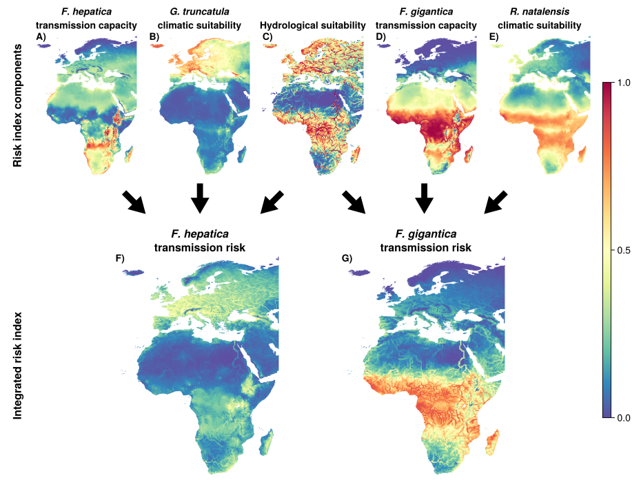

# The uneven impact of climate change on fascioliasis across Africa and Europe

</img>

This repository contains code and data for "Novel integrated risk index reveals uneven impact of climate change on fascioliasis across Africa and Europe" (submitted).

In this study, we develop a novel climate-based risk index for transmission of the liver flukes _Fasciola hepatica_ and _Fasciola gigantica_ under climate change scenarios. We use life history traits from the literature to estimate temperature suitability, and combine this with output from hydrological models.

All figures shown in the paper and all code used to produce them are included in this repository. Life history data and most occurrence data is included in the `data` folder, while GBIF data, climate data and ISIMIP data are automatically downloaded.

## Understanding this repository
This repository is formatted as a Julia package. The `Project.toml` specifies which packages it relies on. The `src` folder contains its internal code and the `data` folder contain data files. The only code you have to interact with directly to reproduce all analysis in the paper is located in the `scripts` folder. 

## Reproducing the analysis
First clone this repository and navigate to the folder.

### Installing julia and instantiating the environment
All analysis is performed in the Julia 1.11. The recommended way to install Julia is through [juliaup](https://github.com/JuliaLang/juliaup). 

After installing julia, navigate to this repository, then type `]` in the Julia REPL to enter package mode, and type `activate .` followed by `instantiate` build a reproducible environment that contains all packages necessary to run the code.

### Downloading data
All data used in the study is either included in the repository or will be automatically downloaded. This includes large amounts (10s of GB) of raster data, which will be downloaded to a path specified in `ENV["RASTERDATASOURCES_PATH]`. You have set to set this variable to some path in your system by running `ENV["RASTERDATASOURCES_PATH"] = "my/data/path"` in the Julia REPL. The data will then be stored in several sub-folders.

### Running the code
The `scripts` folder contains three Julia scripts: `scripts/main.jl` runs the analysis, while `scripts/figures.jl` and `scripts/tables.jl` use the Julia objects to create figures and tables in the publications. These are saved in the `images` and `tables` folders. 

You could run these from the command line by navigating the this folder, opening a Julia REPL by running the `julia` command, and then running each of the three the scripts using an include statements (`include("scripts/main.jl")` etc).

Alternatively, you can use an environment like Visual Studio Code to run them line-by-line.

### Contact
Tiem van der Deure

email: tvd@sund.ku.dk